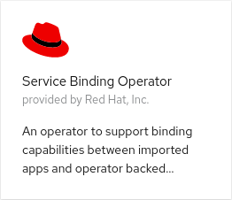
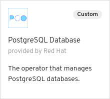

# `service-binding-operator`: Connect Applications with Operator-backed Services

<p align="center">
    <a alt="GoReport" href="https://goreportcard.com/report/github.com/redhat-developer/service-binding-operator">
        
    </a>
    <a href="https://godoc.org/github.com/redhat-developer/service-binding-operator">
        
    </a>
</p>

## Introduction

The goal of the Service Binding Operator is to enable application authors to import an application
and run it on OpenShift with operator-backed services such as databases, without having to perform
manual configuration of secrets, configmaps, etc.

In order for the Service Binding Operator to bind an application to a backing service, the backing
service operator must specify the information required by the application to bind to the
operator's service. The information must be specified in the operator's OLM (Operator Lifecycle
Manager) descriptor from which it will be extracted to bind the application to the operator. The
information could be specified in the "status" and/or "spec" section of the OLM in plaintext or as
a reference to a secret.

In order to make an imported application (for example, a NodeJS application) connect to a backing
services (for example, a database):

* The app author (developer) creates a `ServiceBindingRequest` and specifies:
  * The resource that needs the binding information. The resource can be specified by label
    selectors;
  * The backing service's resource reference that the imported application needs to be bound to;

* The Service Binding Controller then:
  * Reads backing service operator OLM descriptor to discover the binding attributes
  * Creates a binding secret for the backing service, example, an operator-managed database;
  * Injects environment variables into the applications's `DeploymentConfig`, `Deployment` or
    `Replicaset`;

Here is an example of the *bind-able* operator OLM Descriptor -- in this case for a PostgreSQL
database backing operator:

``` yaml
---
[...]
statusDescriptors:
  description: Name of the Secret to hold the DB user and password
    displayName: DB Password Credentials
    path: dbCredentials
    x-descriptors:
      - urn:alm:descriptor:io.kubernetes:Secret
      - urn:alm:descriptor:servicebindingrequest:env:object:secret:user
      - urn:alm:descriptor:servicebindingrequest:env:object:secret:password
  description: Database connection IP address
    displayName: DB IP address
    path: dbConnectionIP
    x-descriptors:
      - urn:alm:descriptor:servicebindingrequest:env:attribute
```

## Quick Start

Clone the repository and run `make local` in an existing `kube:admin` openshift CLI session.
Alternatively, install the operator using:

``` bash
cat <<EOS |kubectl apply -f -
---
apiVersion: operators.coreos.com/v1
kind: OperatorSource
metadata:
  name: redhat-developer-operators
  namespace: openshift-marketplace
spec:
  type: appregistry
  endpoint: https://quay.io/cnr
  registryNamespace: redhat-developer
EOS
```

## Example Scenario

In this example there are 2 roles:

* Cluster Admin - Installs the operators to the cluster
* Application Developer - Imports a Node.js application, creates a DB instance, creates a request to bind the application and DB (to connect the DB and the application).

### Cluster Admin

The cluster admin needs to install 2 operators into the cluster:

* Service Binding Operator
* Backing Service Operator

A Backing Service Operator that is "bind-able," in other
words a Backing Service Operator that exposes binding information in secrets, config maps, status, and/or spec
attributes. The Backing Service Operator may represent a database or other services required by
applications. We'll use [postgresql-operator](https://github.com/baijum/postgresql-operator) to
demonstrate a sample use case.

#### Install the Service Binding Operator using an `OperatorSource`

Apply the following `OperatorSource`:

``` bash
cat <<EOS |kubectl apply -f -
---
apiVersion: operators.coreos.com/v1
kind: OperatorSource
metadata:
  name: redhat-developer-operators
  namespace: openshift-marketplace
spec:
  type: appregistry
  endpoint: https://quay.io/cnr
  registryNamespace: redhat-developer
EOS
```

Then navigate to the `Operators`->`OperatorHub` in the OpenShift console and in the `Other` category select the `Service Bidning Operator` operator



and install a `stable` version.

This makes the `ServiceBindingRequest` custom resource available, that the application developer will use later.

#### Install the DB operator using an `OperatorSource`

Apply the following `OperatorSource`:

``` bash
cat <<EOS |kubectl apply -f -
---
apiVersion: operators.coreos.com/v1
kind: OperatorSource
metadata:
  name: db-operators
  namespace: openshift-marketplace
spec:
  type: appregistry
  endpoint: https://quay.io/cnr
  registryNamespace: pmacik
EOS
```

Then navigate to the `Operators`->`OperatorHub` in the OpenShift console and in the `Database` category select the `PostgreSQL Database` operator



and install a `stable` version.

This makes the `Database` custom resource available, that the application developer will use later.

### Application Developer

#### Create a namespace called `service-binding-demo`

The application and the DB needs a namespace to live in so let's create one for them:

``` bash
cat <<EOS |kubectl apply -f -
---
kind: Namespace
apiVersion: v1
metadata:
  name: service-binding-demo
EOS
```

#### Import an application

In this example we will import an arbitrary [Node.js application](https://github.com/pmacik/nodejs-rest-http-crud).

In the OpenShift Console switch to the Developer perspective. (Make sure you have selected the `service-binding-demo` project). Navigate to the `+ADD` page from the menu and then click on the `[Import from Git]` button. Fill in the form with the following:

* `Git Repo URL` = `https://github.com/pmacik/nodejs-rest-http-crud`
* `Project` = `service-binding-demo`
* `Application`->`Create New Application` = `NodeJSApp`
* `Name` = `nodejs-app`
* `Builder Image` = `Node.js`
* `Create a route to the application` = checked

and click on the `[Create]` button.

Notice, that during the import no DB config was mentioned or requestd.

When the application is running navigate to its route to verify that it is up. Notice that in the header it says `(DB: N/A)`. That meens that the application is not connected to a DB and so it should not work properly. Try the application's UI to add a fruit - it causes an error proving that the DB is not connected.

#### Create a DB instance for the application

Now we utilize the DB operator that the cluster admin has installed. To create a DB instance just create a `Database` custom resource in the `service-binding-demo` namespace called `db-demo`:

``` bash
cat <<EOS |kubectl apply -f -
---
apiVersion: postgresql.baiju.dev/v1alpha1
kind: Database
metadata:
  name: db-demo
  namespace: service-binding-demo
spec:
  image: docker.io/postgres
  imageName: postgres
  dbName: db-demo
EOS
```

#### Set labels on the application

Now the we need to set arbitrary labels on the application's `DeploymentConfig` in order for the Service Binding Operator to be able to find the application.

The labels are:

* `connects-to=postgres` - indicates that the application needs to connect to a PostgreSQL DB
* `environment=demo` - indicates the demo environment - it narrows the search

``` bash
 kubectl patch dc nodejs-app -p '{"metadata": {"labels": {"connects-to": "postgres", "environment":"demo"}}}'
```

#### Express an intent to bind the DB and the application

Now the only thing that remains is to connect the DB and the application. We let the Service Binding Operator to 'magically' do the connection for us.

Create the following `ServiceBindingRequest`:

``` bash
cat <<EOS |kubectl apply -f -
---
apiVersion: apps.openshift.io/v1alpha1
kind: ServiceBindingRequest
metadata:
  name: binding-request
  namespace: service-binding-demo
spec:
  applicationSelector:
    matchLabels:
      connects-to: postgres
      environment: demo
    resourceKind: DeploymentConfig
  backingServiceSelector:
    resourceKind: postgresql.baiju.dev
    resourceVersion: v1alpha1
    resourceRef: db-demo
EOS
```

There are 2 parts in the request:

* `applicationSelector` - used to search for the application based on the labels that we set earlier and the `resourceKind` of the application to be a `DeploymentConfig`.
* `backingServiceSelector` - used to find the backing service - our operator-backed DB instance called `db-demo`.

That causes the application to be re-deployed.

Once the new version is up, go the application's route to check the UI. In the header you can see `(DB: db-demo)` which indicates that the application is connected to a DB and its name is `db-demo`. Now you can try the UI again but now it works!

When the `ServiceBindingRequest` was created the Service Binding Operator's controller injected the DB connection information as specified in the OLM descriptor below, into the
application's `DeploymentConfig` as environment variables via an intermediate `Secret` called `bidning-request`:

``` yaml
spec:
  template:
    spec:
      containers:
        - envFrom:
          - secretRef:
              name: binding-request
```

That's it, folks!
