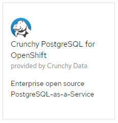
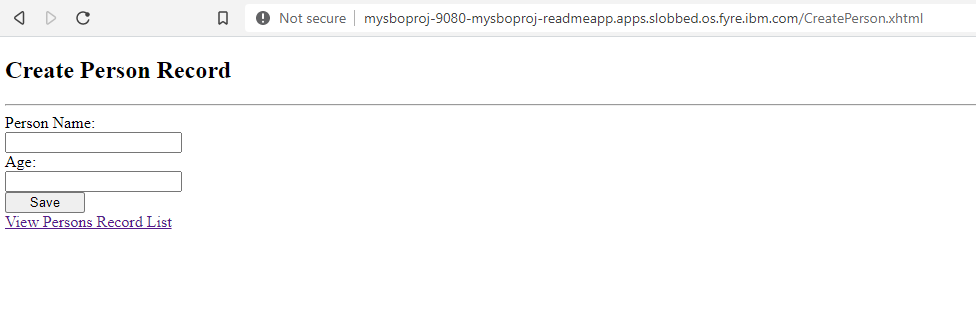
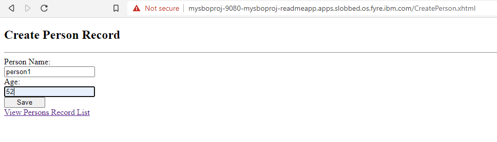
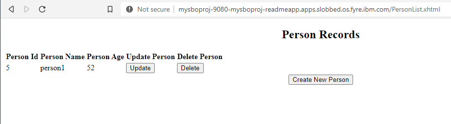

# Binding a Java Microservices JPA app to an In-cluster Operator Managed PostgreSQL Database

## Introduction

This scenario illustrates binding an odo managed Java MicroServices JPA application to an in-cluster operater managed PostgreSQL Database.

## What is odo?

odo is a CLI tool for creating applications on OpenShift and Kubernetes. odo allows developers to concentrate on creating applications without the need to administer a cluster itself. Creating deployment configurations, build configurations, service routes and other OpenShift or Kubernetes elements are all automated by odo.

Before proceeding, please [install the latest v2.0.0-alpha-2 odo CLI](https://odo.dev/docs/installing-odo/)

## Actions to Perform by Users in 2 Roles

In this example there are 2 roles:

* Cluster Admin - Installs the operators to the cluster
* Application Developer - Imports a Java MicroServices JPA application, creates a DB instance, creates a request to bind the application and DB (to connect the DB and the application).

### Cluster Admin

The cluster admin needs to install 2 operators into the cluster:

* Service Binding Operator
* Backing Service Operator

A Backing Service Operator that is "bind-able," in other
words a Backing Service Operator that exposes binding information in secrets, config maps, status, and/or spec
attributes. The Backing Service Operator may represent a database or other services required by
applications. We'll use [Crunchy Data PostgreSQL Operator](https://operatorhub.io/operator/postgresql) to
demonstrate a sample use case.

#### Install the Service Binding 

**PLEASE NOTE:** This sample demonstrates the use of odo and Red Hat Service Binding Operator(Community Operator) version 0.1.1-364, available for installation via the OpenShift OperatorHub.

Navigate to the `Operators`->`OperatorHub` in the OpenShift console and in the `Developer Tools` category select the `Service Binding Operator` operator


Alternatively, you can perform the same task manually using the following command:

``` shell
make install-service-binding-operator-community
```

This makes the `ServiceBindingRequest` custom resource available, that the application developer will use later.

##### :bulb: Latest `master` version of the operator

It is also possible to install the latest `master` version of the operator instead of the one from `community-operators`. To enable that an `OperatorSource` has to be installed with the latest `master` version:

``` shell
cat <<EOS | kubectl apply -f -
---
apiVersion: operators.coreos.com/v1
kind: OperatorSource
metadata:
  name: redhat-developer-operators
  namespace: OpenShift-marketplace
spec:
  type: appregistry
  endpoint: https://quay.io/cnr
  registryNamespace: redhat-developer
EOS
```

Alternatively, you can perform the same task manually using the following command before going to the Operator Hub:

``` shell
make install-service-binding-operator-source-master
```

or running the following command to install the operator completely:

``` shell
make install-service-binding-operator-master
```

#### Install the DB operator

Login to your OpenShift terminal for all command line operations

Follow the installations instructions for [Installing Crunchy PostgreSQL for Kubernetes](https://operatorhub.io/operator/postgresql)

When you have completed the `Before You Begin` instructions, you may access your OpenShift Console and install the Crunchy PostgreSQL Operator from the Operator Hub:



After the instalation completes via the Operator Hub, please follow the instructions in the `After You Install` section.

### Application Developer

#### Access your OpenShift terminal and oc login to the OpenShift Cluster

#### Create a database cluster instance called `my-demo-db` 

> What is the pgo CLI? The pgo cli is a terminal command line interface for the Crunchy PostgreSQL Operator - it allows you to create namespaces and database instances that will be managed by the Crunchy PostgreSQL Operator. Then pgo CLI was installed as part of the Crunchy PostgreSQL installation process that you followed earlier.

Use the pgo CLI to create a db cluster instance in the pgo namespace you created during the installation of the Operator. This instance will be a postgreSQL db managed by the Crunchy PostgreSQL Operator.

```shell
pgo create cluster my-demo-db -n pgo
```

#### Import the demo Java MicroService JPA application

In this example we will use odo to manage a sample [Java MicroServices JPA application](https://github.com/OpenLiberty/application-stack-samples.git).

From the OpenShift terminal, create a project directory `my-sample-jpa-app`

cd to that directory and choosed the namespace we created above for the application:

```shell
> oc project service-binding-demo
```
git clone the sample app repo to this directory.
```shell
> git clone https://github.com/OpenLiberty/application-stack-samples.git
```
cd to the sample JPA app
```shell
> cd ./application-stack-samples/java-openliberty/samples/jpa
```
initialize project using odo
```shell
> odo create java-openliberty mysboproj
```
Create an OpenShift route to access the application
```shell
> odo url create --port 9080
```

Perform an initial odo push of the app to the cluster
```shell
> odo push 
```

The application is now deployed to the cluster - you can view the status of the cluster and the application test results by streaming the OpenShift logs to the terminal

```shell
> odo log
```
Notice the failing tests due to a missing database connection.

```shell
[INFO] Exception Description: Predeployment of PersistenceUnit [jpa-unit] failed.
[INFO] Internal Exception: javax.persistence.PersistenceException: CWWJP0013E: The server cannot locate the jdbc/DefaultDataSource data source for the jpa-unit persistence unit because it has encountered the following exception: javax.naming.NameNotFoundException: Intermediate context does not exist: jdbc/DefaultDataSource.
[INFO] [err] java.lang.NullPointerException
[INFO] [err]    at org.example.app.PersonResource.getAllPeople(PersonResource.java:74)
[INFO] [err]    at org.example.app.PersonResource$Proxy$_$$_WeldClientProxy.getAllPeople(Unknown Source)
[INFO] [err]    at jdk.internal.reflect.GeneratedMethodAccessor537.invoke(Unknown Source)
[INFO] [err]    at java.base/java.lang.reflect.Method.invoke(Method.java:566)
[INFO] [err]    at com.ibm.ws.jaxrs20.cdi.component.JaxRsFactoryImplicitBeanCDICustomizer.serviceInvoke(JaxRsFactoryImplicitBeanCDICustomizer.java:339)
[INFO] [err]    at [internal classes]
[INFO] [err]    at javax.servlet.http.HttpServlet.service(HttpServlet.java:686)
[INFO] [err]    at com.ibm.websphere.jaxrs.server.IBMRestServlet.service(IBMRestServlet.java:96)
[INFO] [err]    at [internal classes]
[INFO] [err]    at java.base/java.util.concurrent.ThreadPoolExecutor.runWorker(ThreadPoolExecutor.java:1128)
[INFO] [err]    at java.base/java.util.concurrent.ThreadPoolExecutor$Worker.run(ThreadPoolExecutor.java:628)
[INFO] [err]    at java.base/java.lang.Thread.run(Thread.java:834)
6590 INFO org.microshed.testing.jaxrs.JsonBProvider  - Response from server: []

```

You can also access the application via the OpenShift URL created ealier. To see the URL that was created, list it
```shell
> odo url list
```
You will see a fully formed URL that can be used in a web browser
```shell
$ odo url list
Found the following URLs for component myjfstesingapp
NAME     STATE      URL                                                 PORT     SECURE     KIND
ep1      Pushed     http://ep1-jpa-pgo.apps.slobbed.os.fyre.ibm.com     9080     false      route
```

Use URL to navigate to the CreatePerson.xhtml data entry page and enter requested data, clicking on the "Save" button when complete



Note that the entry of any data does not result in the data being displayed when you click on the "View Persons Record List" link

#### Express an intent to bind the DB and the application

Now, the only thing that remains is to connect the DB and the application. We will use odo to create a link to the Service Binding Operator and will manually configure the resulting Service Binding Request to 'magically' do the connection for us.

List the services available
```shell
> odo service list
NAME                                  AGE
Pgcluster/example                     1154h25m9s
Pgcluster/my-demo-db                  2h30m33s
Pgtask/backrest-backup-my-demo-db     2h28m8s
Pgtask/my-demo-db-createcluster       2h30m33s
Pgtask/my-demo-db-stanza-create       2h28m47s
>
```
Create a Service Binding Request between the application and the database using the Pgcluster service for the DB

```shell
> odo link Pgcluster/my-demo-db
```

push this link to the cluster
```shell
> odo push
```

You have now created a Service Binding Request object in the namespace on behalf of your application. We must manually configure the YAML files associated with it and the Custom Resource Object associated with the database in order to link them both together.

You can see this Service Binding Request via kubectl
```shell
>  kubectl get servicebindingrequest
NAME                       AGE
jpa-pgcluster-my-demo-db   36m
>
```
Or, alternatively, you can inspect the SBR via the OpenShift console in Administrator view by navigating to Operators > Installed Operators > Service Binding Operator and clicking on the Service Binding Request tab. Select the Service Binding Request Instance named `jpa-pgcluster-my-demo-db`

#### Manually configure YAML files

Access the OpenShift console and navigate to Administration > Custom Resource Definitions > Pgcluster and click on the 'Instances' tab

Click on your db cluster instance name 'my-demo-db'
Edit the YAML and add the following annotations to the annotations block within the meta-data block

```yaml
metadata:
  annotations:
    servicebindingoperator.redhat.io/spec.database: 'binding:env:attribute'
    servicebindingoperator.redhat.io/spec.namespace: 'binding:env:attribute'
    servicebindingoperator.redhat.io/spec.port: 'binding:env:attribute'
    servicebindingoperator.redhat.io/spec.usersecretname-password: 'binding:env:object:secret'
    servicebindingoperator.redhat.io/spec.usersecretname-username: 'binding:env:object:secret'
```
The complete Pgcluster CR Instance YAML once edited:
```yaml
apiVersion: crunchydata.com/v1
kind: Pgcluster
metadata:
  annotations:
    current-primary: my-demo-db
    primary-deployment: my-demo-db
    servicebindingoperator.redhat.io/spec.database: 'binding:env:attribute'
    servicebindingoperator.redhat.io/spec.namespace: 'binding:env:attribute'
    servicebindingoperator.redhat.io/spec.port: 'binding:env:attribute'
    servicebindingoperator.redhat.io/spec.usersecretname-password: 'binding:env:object:secret'
    servicebindingoperator.redhat.io/spec.usersecretname-username: 'binding:env:object:secret'
  selfLink: /apis/crunchydata.com/v1/namespaces/readmeapp/pgclusters/my-demo-db
  resourceVersion: '114097331'
  name: my-demo-db
  uid: 5e25b9ea-7d11-45c6-9a6b-0165a2dc8dc1
  creationTimestamp: '2020-09-03T20:15:42Z'
  generation: 5
  namespace: readmeapp
  labels:
    pgouser: admin
    pgo-version: 4.4.0
    pg-cluster: my-demo-db
    crunchy-pgbadger: 'false'
    name: my-demo-db
    autofail: 'true'
    pgo-backrest: 'true'
    deployment-name: my-demo-db
    pg-pod-anti-affinity: ''
    crunchy_collect: 'false'
    crunchy-pgha-scope: my-demo-db
    workflowid: 89863c51-72b9-4e6b-85d3-25b8d51f11bb
spec:
  BackrestStorage:
    accessmode: ReadWriteOnce
    matchLabels: ''
    name: ''
    size: 5Gi
    storageclass: rook-ceph-cephfs-internal
    storagetype: dynamic
    supplementalgroups: ''
  backrestS3URIStyle: ''
  port: '5432'
  exporterport: '9187'
  ReplicaStorage:
    accessmode: ReadWriteOnce
    matchLabels: ''
    name: ''
    size: 5Gi
    storageclass: rook-ceph-cephfs-internal
    storagetype: dynamic
    supplementalgroups: ''
  collectSecretName: my-demo-db-collect-secret
  resources:
    memory: 128Mi
  backrestS3Bucket: ''
  clustername: my-demo-db
  usersecretname: my-demo-db-testuser-secret
  backrestS3VerifyTLS: 'true'
  tlsOnly: false
  pgbadgerport: '10000'
  backrestResources:
    memory: 48Mi
  userlabels:
    crunchy_collect: 'false'
    pg-pod-anti-affinity: ''
    pgo-version: 4.4.0
    workflowid: 89863c51-72b9-4e6b-85d3-25b8d51f11bb
  name: my-demo-db
  ccpimage: crunchy-postgres-ha
  user: testuser
  standby: false
  ccpimagetag: ubi7-12.3-4.4.0
  podAntiAffinity:
    default: preferred
    pgBackRest: preferred
    pgBouncer: preferred
  backrestS3Region: ''
  policies: ''
  backrestS3Endpoint: ''
  syncReplication: null
  backrestRepoPath: ''
  tablespaceMounts: {}
  status: completed
  pgBouncer:
    limits: {}
    replicas: 0
    resources:
      memory: 24Mi
  backrestLimits: {}
  customconfig: ''
  pgoimageprefix: registry.connect.redhat.com/crunchydata
  shutdown: false
  limits: {}
  WALStorage:
    accessmode: ''
    matchLabels: ''
    name: ''
    size: ''
    storageclass: ''
    storagetype: ''
    supplementalgroups: ''
  PrimaryStorage:
    accessmode: ReadWriteOnce
    matchLabels: ''
    name: my-demo-db
    size: 5Gi
    storageclass: rook-ceph-cephfs-internal
    storagetype: dynamic
    supplementalgroups: ''
  ArchiveStorage:
    accessmode: ''
    matchLabels: ''
    name: ''
    size: ''
    storageclass: ''
    storagetype: ''
    supplementalgroups: ''
  tls:
    caSecret: ''
    replicationTLSSecret: ''
    tlsSecret: ''
  namespace: readmeapp
  database: my-demo-db
  replicas: '0'
  pgDataSource:
    restoreFrom: ''
    restoreOpts: ''
  primarysecretname: my-demo-db-primaryuser-secret
  ccpimageprefix: registry.connect.redhat.com/crunchydata
  rootsecretname: my-demo-db-postgres-secret
status:
  message: Cluster has been initialized
  state: pgcluster Initialized
  ```
Save this YAML file and reload it.

Navigate to Operators > Installed Operators > Service Binding Operator and click on the 'Instances' tab

Click on the Service Binding Request you created in the previous section and edit its YAML file

We will edit the `backingServiceSelector` . This section is used to find the backing service - our operator-backed DB instance called `db-demo`.

Replace the `backingServiceSelector` block with the following YAML snippet:
```yaml
  backingServiceSelectors:
    - group: crunchydata.com
      kind: Pgcluster
      namespace: service-binding-demo
      resourceRef: my-demo-db
      version: v1
```
Complete YAML file once updated:
```yaml
apiVersion: apps.openshift.io/v1alpha1
kind: ServiceBindingRequest
metadata:
  selfLink: >-
    /apis/apps.openshift.io/v1alpha1/namespaces/readmeapp/servicebindingrequests/mysboproj-servicebindingrequest-example-servicebindingrequest
  resourceVersion: '114116646'
  name: mysboproj-servicebindingrequest-example-servicebindingrequest
  uid: 20983d16-59f2-4b9b-ae56-e3371480821f
  creationTimestamp: '2020-09-03T20:47:16Z'
  generation: 2
  namespace: readmeapp
  ownerReferences:
    - apiVersion: apps/v1
      kind: Deployment
      name: mysboproj
      uid: e3ca87f2-0208-4b00-82bb-db4345f834dd
  finalizers:
    - finalizer.servicebindingrequest.openshift.io
spec:
  applicationSelector:
    group: apps
    resource: deployments
    resourceRef: mysboproj
    version: v1
  backingServiceSelectors:
    - group: crunchydata.com
      kind: Pgcluster
      namespace: service-binding-demo
      resourceRef: my-demo-db
      version: v1
  detectBindingResources: true
status:
  conditions:
    - lastHeartbeatTime: '2020-09-03T21:47:32Z'
      lastTransitionTime: '2020-09-03T20:47:20Z'
      status: 'True'
      type: CollectionReady
    - lastHeartbeatTime: '2020-09-03T21:47:32Z'
      lastTransitionTime: '2020-09-03T20:47:20Z'
      status: 'True'
      type: InjectionReady
  secret: mysboproj-servicebindingrequest-example-servicebindingrequest
```

Save and re-load this YAML file.

You have now created an intermediate secret object called `jpa-pgcluster-my-demo-db` in the cluster that can be used by your application. You can see this secret via kubectl

```shell
kubectl get secret jpa-pgcluster-my-demo-db
NAME                                                            TYPE     DATA   AGE
jpa-pgcluster-my-demo-db   Opaque   5      13m
>
```
Or, alternatively, you can inspect the new intermediate secret via the OpenShift console in Administrator view by navigating to Workloads > Secrets and clicking on the secret named `jpa-pgcluster-my-demo-db` Notice it contains 5 pieces of data all related to the connection information for your PostgreSQL database instance.

Re-deploy the applications using odo
```shell
odo push -f
```

Once the new version is up (there will be a slight delay until application is available), navigate to the CreatePerson.xhtml using the URL created in a previous step. Enter requested data and click the "Save" button


Notice you are re-directed to the PersonList.xhtml page, where your data is displayed having been input to the postgreSQL database and retrieved for display purposes.


You may inspect the database instance itself and query the table to see the data in place by using the postgreSQL command line tool, psql.

Navigate to the pod containing your db from the OpenShift Console

Click on the terminal tab.

At the terminal prompt access psql for your database

```shell
sh-4.2$ psql my-demo-db
psql (12.3)
Type "help" for help.

my-demo-db=#
```

Issue the following SQL statement:

```shell
my-demo-db=# SELECT * FROM testuser.person;
```

You can see the data that appeared in the results of the test run:
```shell
 personid | age |  name   
----------+-----+---------
        5 |  52 | person1
(1 row)

my-demo-db=# 
```
