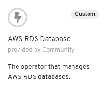

# Binding an application to an Off-cluster Operator Managed AWS RDS Database

## Introduction

This scenario illustrates binding an application to an off-cluster operated managed AWS RDS Database. The scenario also shows how to bind the backing service to two different independent applications and use of the `namePrefix` feature of the Service Binding Operator to specify a prefix for the names of the injected environment variables.

## Actions to Perform by Users in 2 Roles

In this example there are 2 roles:

* Cluster Admin - Installs the operators to the cluster
* Application Developer - Imports a shell application, creates a DB instance, creates request to bind (connect) the application and the DB.

### Cluster Admin

First, let's be the cluster admin. We need to install 2 operators into the cluster:

* Service Binding Operator
* Backing Service Operator

The Backing Service Operator represents a database required by the
applications. We'll use [aws-rds-operator](https://github.com/operator-backing-service-samples/aws-rds) to
manage off-cluster RDS database instances on AWS.

#### Install the Service Binding Operator

Navigate to the `Operators`->`OperatorHub` in the OpenShift console and in the `Developer Tools` category select the `Service Binding Operator` operator


and install the `beta` version.

This makes the `ServiceBinding` custom resource available, that the application developer will use later.

#### Setup AWS Credentials for the operator

The AWS RDS operator requires AWS credentials to be able to work with AWS. Follow the [instructions](https://github.com/operator-backing-service-samples/aws-rds#set-up-and-config) to install the proper secret.

``` shell
AWS_ACCESS_KEY_ID=$(echo -n "..." | base64)
AWS_SECRET_ACCESS_KEY=$(echo -n "..." | base64)
AWS_REGION=$(echo -n "us-east-2" | base64)
kubectl apply -f - << EOD
---
apiVersion: v1
kind: Secret
metadata:
  name: aws-rds-operator
  namespace: openshift-operators
type: Opaque
data:
  AWS_ACCESS_KEY_ID: $AWS_ACCESS_KEY_ID
  AWS_SECRET_ACCESS_KEY: $AWS_SECRET_ACCESS_KEY
  AWS_REGION: $AWS_REGION
EOD
```

#### Install the AWS RDS operator using an `CatalogSource`

Apply the following `CatalogSource`:

```shell
kubectl apply -f - << EOD
---
apiVersion: operators.coreos.com/v1alpha1
kind: CatalogSource
metadata:
    name: sample-db-operators
    namespace: openshift-marketplace
spec:
    sourceType: grpc
    image: quay.io/redhat-developer/sample-db-operators-olm:v1
    displayName: Sample DB Operators
EOD
```

Then navigate to the `Operators`->`OperatorHub` in the OpenShift console under the `openshift-marketplace` project and in the `Database` category select the `AWS RDS Database` operator.



and install it.

This makes the `RDSDatabase` custom resource available, that we as the application developer will [use later](#create-a-db-instance-for-the-application).

### Application Developer

Now, let's play the role of an application developer. In the following sections we will:

* [Create new project (namespace)](#create-a-project-namespace-called-service-binding-demo)
* Deploy 2 applications:
  * [A simple shell application](#deploy-shell-application)
  * [CRUD Node.js application](#import-nodejs-application)
* [Create DB instance](#create-a-db-instance-for-the-application)
* Bind the Shell app to the DB
* Bind the Node.js app to the DB

#### Create a project (namespace) called `service-binding-demo`

The application and the DB needs a namespace to live in so let's create one for them:

``` shell
kubectl create namespace service-binding-demo
```

#### Deploy Shell application

To illustrate and verify that the binding works we will use a simple shell application that lists all environment variables that start with the `MYDB_` prefix and then goes to sleep for an hour.

To deploy the application use the `deploy-shell-app` make target:

```shell
kubectl apply -f - << EOD
---
apiVersion: image.openshift.io/v1
kind: ImageStream
metadata:
  name: shell-app
  namespace: service-binding-demo
EOD
```

```shell
kubectl apply -f - << EOD
apiVersion: build.openshift.io/v1
kind: BuildConfig
metadata:
  name: shell-app
  namespace: service-binding-demo
  labels:
    name: shell-app
spec:
  triggers:
    - type: ConfigChange
  source:
    dockerfile: |
      FROM alpine
      LABEL author="Pavel Macík <pavel.macik@gmail.com>"
      RUN echo 'echo "Container started";\
      echo "Listing all MYDB_* env variables:";\
      echo "╭─[ MYDB_* ]";\
      env | grep MYDB;\
      echo "╰─]";\
      echo "Taking a nap for 1 hour...";\
      sleep 3600'>/run.sh && chmod +x /run.sh
      ENV LANG=en_US.utf8
      ENTRYPOINT [ "/bin/sh", "-c", "/run.sh" ]
    type: Docker
  strategy:
    type: Docker
  output:
    to:
      kind: ImageStreamTag
      name: 'shell-app:latest'
EOD
```

```shell
kubectl apply -f - << EOD
---
apiVersion: apps/v1
kind: Deployment
metadata:
  name: shell-app
  namespace: service-binding-demo
spec:
  selector:
    matchLabels:
      app: shell-app
  replicas: 1
  template:
    metadata:
      labels:
        app: shell-app
    spec:
      containers:
        - name: shell-app
          image: image-registry.openshift-image-registry.svc:5000/service-binding-demo/shell-app
          imagePullPolicy: Always
EOD
```


This ultimately creates a pod where the shell application lives:

```shell
$ kubectl get pods -n service-binding-demo -o custom-columns=NAME:.metadata.name,STATUS:.status.phase
NAME                                  STATUS
shell-app-1-build                     Succeeded
shell-app-65f55dd677-fwfdz            Running

$ kubectl logs shell-app-65f55dd677-fwfdz -n service-binding-demo
Container started
Listing all MYDB_* env variables:
╭─[ MYDB_* ]
╰─]
Taking a nap for 1 hour...
```

#### Create a DB instance for the application

Now we utilize the DB operator that the cluster admin has installed. To create a DB instance just create a `RDSDatabase` custom resource in the `service-binding-demo` namespace called `mydb` along with a secret containing credentials for the DB by applying the following:

``` shell
kubectl apply -f - << EOD
---
apiVersion: v1
kind: Secret
metadata:
  name: mydb
  namespace: service-binding-demo
  labels:
    app: mydb
type: Opaque
data:
  DB_USERNAME: cG9zdGdyZXM=  # postgres
  DB_PASSWORD: cGFzc3dvcmRvcnNvbWV0aGluZw==  # passwordorsomething
EOD
```

```shell
kubectl apply -f - << EOD
---
apiVersion: aws.pmacik.dev/v1alpha1
kind: RDSDatabase
metadata:
  name: mydb
  namespace: service-binding-demo
  labels:
    app: mydb
spec:
  class: db.t2.micro
  engine: postgres
  dbName: mydb
  name: mydb
  password:
    key: DB_PASSWORD
    name: mydb
  username: postgres
  deleteProtection: true
  size: 10
EOD
```

It takes usually around 5 minutes to spin-up a new instance of the RDS database in AWS.

To check the status of that we can take a look at the `RDSDatabase` custom resource in the meantime:

```shell
kubectl get rdsdb mydb -n service-binding-demo -o yaml
```

```yaml
apiVersion: aws.pmacik.dev/v1alpha1
kind: RDSDatabase
metadata:
  ...
spec:
  ...
status:
  dbConnectionConfig: ""
  dbCredentials: ""
  message: Attempting to Create a DB
  state: DBCreating
```

When the DB is successfully created, the status changes to :

```yaml
status:
  dbConnectionConfig: mydb
  dbCredentials: mydb
  message: ConfigMap Created
  state: Completed
```

#### Bind the DB to the Shell application

Now, when the DB is up and running, we need to tell the Shell application where to find it and how to connect to it. We let the Service Binding Operator to 'do the magic' for us.

As mentioned above the Shell application lists all environment variables that start with the `MYDB_` prefix. So we need to make sure that the variables injected by the binding have this prefix. Conveniently, the Service Binding Operator can help us there, too.

All we need to do is to create the following [`ServiceBinding`](./service-binding.shell-app.yaml):

```shell
kubectl apply -f - << EOD
---
apiVersion: binding.operators.coreos.com/v1alpha1
kind: ServiceBinding
metadata:
  name: mydb.to.shell-app
  namespace: service-binding-demo
spec:
  namePrefix: "MYDB"
  services:
  - group: aws.pmacik.dev
    version: v1alpha1
    kind: RDSDatabase
    name: mydb
  application:
    name: shell-app
    group: apps
    version: v1
    resource: deployments
EOD
```

There are 3 interesting parts in the request:

* `namePrefix` - specifies the prefix for all the environment variables injected to the bound application
* `services` - used to find the backing service - our operator-backed DB instance called `mydb`
* `application` - used to search for the application based on the name and the `resourceKind` of the application to be a `DeploymentConfig`

That causes the Shell application to be re-deployed.

```shell
$ kubectl get pods -n service-binding-demo
NAME                         READY   STATUS        RESTARTS   AGE
shell-app-1-build            0/1     Completed     0          76m
shell-app-65f55dd677-26dfz   0/1     Terminating   1          75m
shell-app-755777c4cb-6qdbp   1/1     Running       0          30s
```

Once the new version is up, we can check the logs to verify that the binding worked:

```shell
$ oc logs shell-app-755777c4cb-6qdbp -n service-binding-demo
Container started
Listing all MYDB_* env variables:
╭─[ MYDB_* ]
MYDB_RDSDATABASE_DB_USERNAME=postgres
MYDB_RDSDATABASE_DBNAME=mydb
MYDB_RDSDATABASE_DB_PASSWORD=passwordorsomething
MYDB_RDSDATABASE_DB_HOST=mydb-service-binding-demo.***********.us-east-2.rds.amazonaws.com
MYDB_RDSDATABASE_DB_PORT=9432
╰─]
Taking a nap for 1 hour...
```

We can see that the binding indeed worked and the Service Binding Operator successfully injected all the environment variables that the AWS RDS exposes all starting with our prefix `MYDB_` that we specified above in the `ServiceBinding`.

That's enough for the Shell application. Let's see if the connection to the DB really works. We do that in the next section with the Node.js application.

#### Check the status of Service Binding

`ServiceBinding Status` depicts the status of the Service Binding operator. More info: https://github.com/kubernetes/community/blob/master/contributors/devel/sig-architecture/api-conventions.md#spec-and-status

To check the status of Service Binding, run the command:

```
kubectl get servicebinding mydb.to.shell-app -n service-binding-demo -o yaml
```

Status of Service Binding on successful binding:

```yaml
status:
  conditions:
  - lastHeartbeatTime: "2020-10-15T13:23:36Z"
    lastTransitionTime: "2020-10-15T13:23:23Z"
    status: "True"
    type: CollectionReady
  - lastHeartbeatTime: "2020-10-15T13:23:36Z"
    lastTransitionTime: "2020-10-15T13:23:23Z"
    status: "True"
    type: InjectionReady
  secret: mydb.to.shell-app
```

where

* Conditions represent the latest available observations of Service Binding's state
* Secret represents the name of the secret created by the Service Binding Operator


Conditions have two types `CollectionReady` and `InjectionReady`

where

* `CollectionReady` type represents collection of secret from the service
* `InjectionReady` type represents an injection of the secret into the application

Conditions can have the following type, status and reason:

| Type            | Status | Reason               | Type           | Status | Reason                   |
| --------------- | ------ | -------------------- | -------------- | ------ | ------------------------ |
| CollectionReady | False  | EmptyServiceSelector | InjectionReady | False  |                          |
| CollectionReady | False  | ServiceNotFound      | InjectionReady | False  |                          |
| CollectionReady | True   |                      | InjectionReady | False  | EmptyApplicationSelector |
| CollectionReady | True   |                      | InjectionReady | False  | ApplicationNotFound      |
| CollectionReady | True   |                      | InjectionReady | True   |                          |

That's it, folks!
