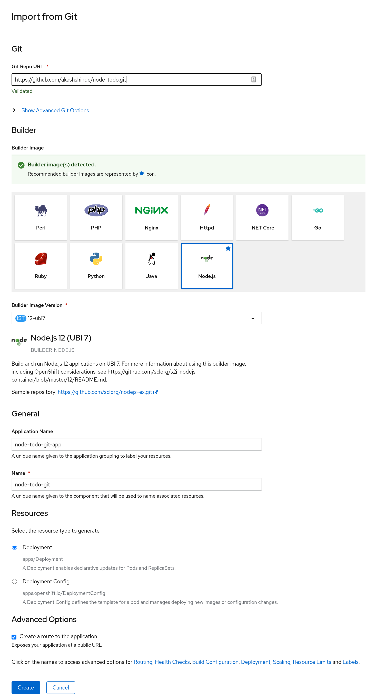

## Binding an Imported app to an In-cluster Operator Managed Etcd Database.

Assuming you have installed Service Binding Operator via OperatorHub.

### Install Etcd operator using operator hub

```shell
kubectl apply -f - << EOD
---
apiVersion: operators.coreos.com/v1alpha1
kind: Subscription
metadata:
  name: etcd
  namespace: openshift-operators
spec:
  channel: clusterwide-alpha
  installPlanApproval: Automatic
  name: etcd
  source: community-operators
  sourceNamespace: openshift-marketplace
  startingCSV: etcdoperator.v0.9.4-clusterwide
EOD
```

### Create an Etcd cluster.
```shell
kubectl apply -f - << EOD
---
apiVersion: "etcd.database.coreos.com/v1beta2"
kind: "EtcdCluster"
metadata:
  annotations:
    etcd.database.coreos.com/scope: clusterwide
  name: "etcd-cluster-example"
spec:
  repository: quay.io/coreos/etcd
  size: 3
  version: "3.2.13"
EOD
```

### Deploy application which uses Etcd client lib using OpenShift 4 devconsole.
Example application : https://github.com/akashshinde/node-todo.git


Note: This example assumes the app is deployed using a K8s Deployment. If using an OCP `DeploymentConfig` change the group and resource in the application to:

```yaml
...
spec:
  ...
  application:
    ...
    group: apps.openshift.io
    version: v1
    resource: deploymentconfigs
```

### Create Service Binding
```shell
kubectl apply -f - << EOD
---
apiVersion: operators.coreos.com/v1alpha1
kind: ServiceBinding
metadata:
  name: binding-request
spec:
  application:
    group: apps
    version: v1
    resource: deployments
    name: node-todo-git
  services:
  - group: etcd.database.coreos.com
    version: v1beta2
    kind: EtcdCluster
    name: etcd-cluster-example
  detectBindingResources: true
EOD
```

5. Application should be bound to the Etcd database automatically.

