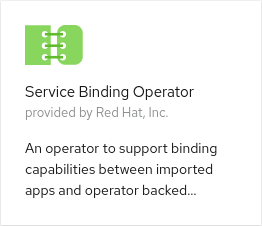

# Binding an Imported app to an In-cluster Operator Managed PostgreSQL Database

## Introduction

This scenario illustrates binding an imported application to an in-cluster operated managed PostgreSQL Database.

Note that this example app is configured to operate with OpenShift 4.5 or newer.

## Actions to Perform by Users in 2 Roles

In this example there are 2 roles:

* Cluster Admin - Installs the operators to the cluster
* Application Developer - Imports a Node.js application, creates a DB instance, creates a request to bind the application and DB (to connect the DB and the application).

### Cluster Admin

The cluster admin needs to install 2 operators into the cluster:

* Service Binding Operator
* Backing Service Operator

A Backing Service Operator that is "bind-able," in other
words a Backing Service Operator that exposes binding information in secrets, config maps, status, and/or spec
attributes. The Backing Service Operator may represent a database or other services required by
applications. We'll use [postgresql-operator](https://github.com/operator-backing-service-samples/postgresql-operator) to
demonstrate a sample use case.

#### Install the Service Binding Operator

Navigate to the `Operators`->`OperatorHub` in the OpenShift console and in the `Developer Tools` category select the `Service Binding Operator` operator



and install the `beta` version.

This makes the `ServiceBinding` custom resource available, that the application developer will use later.

#### Install the DB operator using a `CatalogSource`

Apply the following `CatalogSource`:

```shell
kubectl apply -f - << EOD
---
apiVersion: operators.coreos.com/v1alpha1
kind: CatalogSource
metadata:
    name: sample-db-operators
    namespace: openshift-marketplace
spec:
    sourceType: grpc
    image: quay.io/redhat-developer/sample-db-operators-olm:v1
    displayName: Sample DB Operators
EOD
```

Then navigate to the `Operators`->`OperatorHub` in the OpenShift console and in the `Database` category select the `PostgreSQL Database` operator


and install a `beta` version.

This makes the `Database` custom resource available, that the application developer will use later.

### Application Developer

#### Create a namespace called `service-binding-demo`

The application and the DB needs a namespace to live in so let's create one for them:

```shell
kubectl create namespace service-binding-demo
```

#### Import an application

In this example we will import an arbitrary [Node.js application](https://github.com/pmacik/nodejs-rest-http-crud).

In the OpenShift Console switch to the Developer perspective. (Make sure you have selected the `service-binding-demo` project). Navigate to the `+Add` page from the menu and then click on the `[From Git]` button. Fill in the form with the following:

* `Project` = `service-binding-demo`
* `Git Repo URL` = `https://github.com/pmacik/nodejs-rest-http-crud`
* `Builder Image` = `Node.js`
* `Application Name` = `nodejs-app`
* `Name` = `nodejs-app`

* `Select the resource type to generate` = Deployment
* `Create a route to the application` = checked

and click on the `[Create]` button.

Notice, that during the import no DB config was mentioned or requested.

When the application is running navigate to its route to verify that it is up. Notice that in the header it says `(DB: N/A)`. That means that the application is not connected to a DB and so it should not work properly. Try the application's UI to add a fruit - it causes an error proving that the DB is not connected.

#### Create a DB instance for the application

Now we utilize the DB operator that the cluster admin has installed. To create a DB instance just create a `Database` custom resource in the `service-binding-demo` namespace called `db-demo`:

```shell
kubectl apply -f - << EOD
---
apiVersion: postgresql.baiju.dev/v1alpha1
kind: Database
metadata:
  name: db-demo
  namespace: service-binding-demo
spec:
  image: docker.io/postgres
  imageName: postgres
  dbName: db-demo
EOD
```

#### Express an intent to bind the DB and the application

Now, the only thing that remains is to connect the DB and the application. We let the Service Binding Operator to 'magically' do the connection for us.

Create the following `ServiceBinding`:

```shell
kubectl apply -f - << EOD
---
apiVersion: operators.coreos.com/v1alpha1
kind: ServiceBinding
metadata:
  name: binding-request
  namespace: service-binding-demo
spec:
  application:
    name: nodejs-app
    group: apps
    version: v1
    resource: deployments
  services:
  - group: postgresql.baiju.dev
    version: v1alpha1
    kind: Database
    name: db-demo
EOD
```

There are 2 parts in the request:

* `application` - used to search for the application based on the name that we set earlier and the `group`, `version` and `resource` of the application to be a `Deployment`.
* `services` - used to find the backing service - our operator-backed DB instance called `db-demo`.

That causes the application to be re-deployed.

Once the new version is up, go to the application's route to check the UI. In the header you can see `(DB: db-demo)` which indicates that the application is connected to a DB and its name is `db-demo`. Now you can try the UI again but now it works!

When the `ServiceBinding` was created the Service Binding Operator's controller injected the DB connection information into the application's `Deployment` as environment variables via an intermediate `Secret` called `binding-request`:

``` yaml
spec:
  template:
    spec:
      containers:
        - envFrom:
          - secretRef:
              name: binding-request
```

#### Check the status of Service Binding

`ServiceBinding Status` depicts the status of the Service Binding operator. More info: https://github.com/kubernetes/community/blob/master/contributors/devel/sig-architecture/api-conventions.md#spec-and-status

To check the status of Service Binding, run the command:

```
kubectl get servicebinding binding-request -n service-binding-demo -o yaml
```

Status of Service Binding on successful binding:

```yaml
status:
  conditions:
  - lastHeartbeatTime: "2020-10-15T13:23:36Z"
    lastTransitionTime: "2020-10-15T13:23:23Z"
    status: "True"
    type: CollectionReady
  - lastHeartbeatTime: "2020-10-15T13:23:36Z"
    lastTransitionTime: "2020-10-15T13:23:23Z"
    status: "True"
    type: InjectionReady
  secret: binding-request
```

where

* Conditions represent the latest available observations of Service Binding's state
* Secret represents the name of the secret created by the Service Binding Operator


Conditions have two types `CollectionReady` and `InjectionReady`

where

* `CollectionReady` type represents collection of secret from the service
* `InjectionReady` type represents an injection of the secret into the application

Conditions can have the following type, status and reason:

| Type            | Status | Reason               | Type           | Status | Reason                   |
| --------------- | ------ | -------------------- | -------------- | ------ | ------------------------ |
| CollectionReady | False  | EmptyServiceSelector | InjectionReady | False  |                          |
| CollectionReady | False  | ServiceNotFound      | InjectionReady | False  |                          |
| CollectionReady | True   |                      | InjectionReady | False  | EmptyApplicationSelector |
| CollectionReady | True   |                      | InjectionReady | False  | ApplicationNotFound      |
| CollectionReady | True   |                      | InjectionReady | True   |                          |

That's it, folks!
